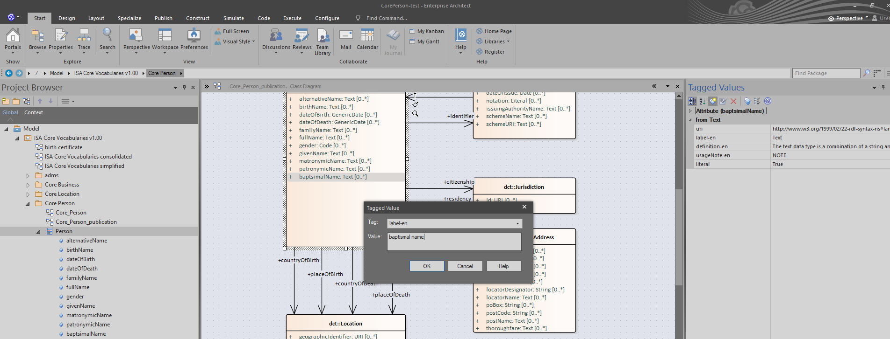

#### [<<< Previous page: Task-Managing Persistent URIs ](managing_persistent_URIs.md) --- [Next page: Task-Deploy new software releases >>>](deploy_new_software_releases.md)

## Task: Editing HTML specifications

### UC4: Update the publication metadata of the specification

**Objective**

There is a need to update the metadata of the specification; in order to create a draft for this new release, the following properties are going to be updated:

* Publication state, to be set to “SEMIC Draft”
* Publication date, to be set to “2023-01-01”

**Roles involved**

* An editor that needs to update the specification

**Prior Knowledge**

* How to pull, commit and push in a Git repository
* Be able to understand a JSON structure to edit configuration files

**Repositories**

* SEMIC thema repository, to access the JSON configuration file
* SEMIC publication repository, to access  the JSON publication file
* SEMIC generated repository, to verify the artefact generated

**Tools**

* A Git client to pull, commit and push to the repositories
* A text editor, to edit configuration file
* To test, a web browser that can display the HTML specification

**Steps**

1. Pull the latest code from the SEMIC thema repository
2. Open with a text editor the core-person-test.json under the config property
3. Change the respective lines:

	```
	"publication-state": "Semic Draft",
	"publication-date": "2023-01-01",
	```

    Be careful to add a “,” character after each line and save the file.

4. Commit and push the file changed in the SEMIC thema repository
5. Pull the latest code from the SEMIC publication repository
6. Update the publication.json file in the SEMIC publication repository by changing the dummy value to

	```
	"dummy": "3",
	```

    and commit and push to the SEMIC publication repository

**Test the result**

Once the publication process ends, pull the latest code from the SEMIC generated repository and verify under the doc/core-vocabulary folder, that there is a core-person-test folder including the index.html file.

Open the index.html with a browser and verify that the 2 properties have been correctly updated.


### UC5: Adding a changelog section in the specification

**Objective**

Having created a new property in UC2, there is a need to inform readers of the new specification about what has been changed via a change log. The change log will be a  custom section in the specification.

**Roles involved**

* An editor that needs to update the specification with a changelog

**Prior Knowledge**

* How to pull, commit and push in a Git repository
* Be able to understand a JSON structure to edit configuration files
* Be able to understand the template structure  

**Repositories**

* SEMIC thema repository, to access the JSON configuration and the template files
* SEMIC publication repository, to access the JSON publication file
* SEMIC generated repository, to verify the artefact generated

**Tools**

* A Git client to pull, commit and push to the repositories
* A text editor, to edit configuration files
* To test, a web browser that can display the HTML specification

**Steps**

7. Pull the latest code from the SEMIC thema repository
8. Open with a text editor the core-person-test.json under the config property
9. Change the following line:

	```
	 "template": "core-person-ap-test_en.j2",
	```

    Be careful to add a “,” character at the end of the line and save the file.

10. Now go in the “template” folders and duplicate the core-person-ap_en.j2 file into core-person-ap-test_en.j2
11. Open the core-person-ap-test_en.j2 and change the change log section with the following text and save the file:

	```
	
	<p>
	The new property "baptsimal name" has been added.
	<p>
	
	```

    Notice the  at the beginning and the  at the end to enclose the changelog block that will be used by a generic template.

12. Commit and push the files changed in the SEMIC thema repository
13. Pull the latest code from the SEMIC publication repository
14. Update the publication.json file in the SEMIC publication repository by changing the dummy value to

	```
	"dummy": "4",
	```

    and commit and push to the SEMIC publication repository

**Test the result**

Once the publication process ends, pull the latest code from the SEMIC generated repository and verify under the doc/core-vocabulary folder, that there is a core-person-test folder including the index.html file.

Open the index.html with a browser and verify that the section change log has been correctly updated.



### UC6: Changing the colour of the hyperlinks

**Objective**

In order to reflect the style of the organisation creating the new specification, the HTML specification can be changed by changing the colour of the hyperlinks to the green colour.

**Roles involved**

* An editor that needs to customise the style of the specification

**Prior Knowledge**

* How to pull, commit and push in a Git repository
* Be able to understand a JSON structure to edit configuration files
* Be able to understand the template structure  
* Knowledge of HTML/CSS to be applied to the new template 

**Repositories**

* SEMIC publication repository, to change the local template
* SEMIC publication repository, to create a generic template and access to the JSON publication file
* SEMIC generated repository, to verify the artefact generated

**Tools**

* A Git client to pull, commit and push to the repositories
* A text editor, to edit configuration files
* To test, a web browser that can display the HTML specification

**Steps**

1. Pull the latest code from the SEMIC thema repository
2. Open the core-person-ap-test_en.j2 in the “template” folder, change the extends header to the following and save the file:

	```
	
	```

3. Commit and push the files changed in the SEMIC thema repository
4. Pull the latest code from the SEMIC publication repository
5. Go under the “templates” folder and duplicate the generic template semic_core_voc.j2 file to semic_core_voc_test.j2 file.
6. Open the semic_core_voc_test.js file with a text editor and add, towards the end, the following lines: 

	```
	a, a:hover {
	   color: #00cc23;
	}
	```

    Just before the  &lt;/style> tag.

7. Update the publication.json file in the SEMIC publication repository by changing the dummy value to

	```
	"dummy": "5",
	```

    and commit and push to the SEMIC publication repository

**Test the result**

Once the publication process ends, pull the latest code from the SEMIC generated repository and verify under the doc/core-vocabulary folder, that there is a core-person-test folder including the index.html file.

Open the index.html with a browser and verify that the colour of the hyperlinks has been correctly updated.


#### [<<< Previous page: Task-Managing Persistent URIs ](managing_persistent_URIs.md) --- [Next page: Task-Deploy new software releases >>>](deploy_new_software_releases.md)